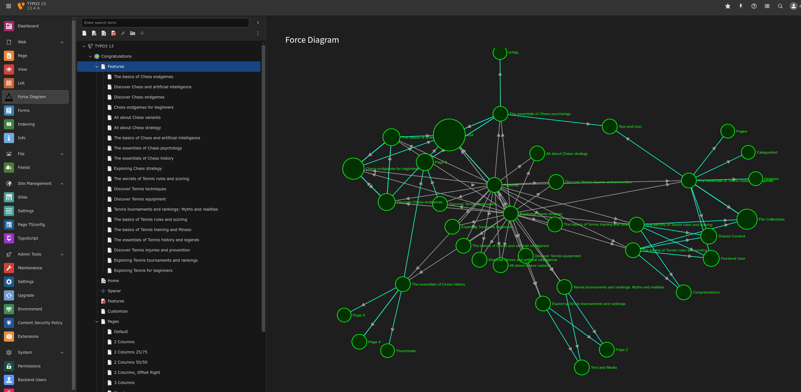
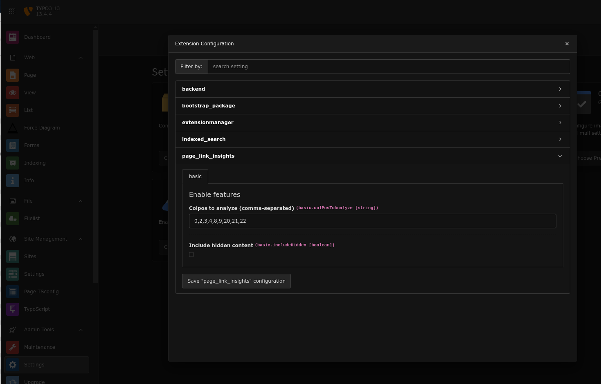
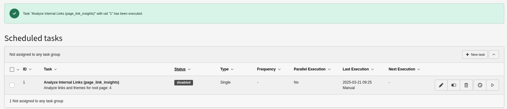

# TYPO3 Page Link Insights Extension



This TYPO3 extension helps you optimize your website's internal linking structure by providing a powerful visual representation of content-based page connections. Page Link Insights focuses specifically on links within your content elements, helping you understand and improve your site's semantic link structure and SEO performance.

## Features

### Comprehensive Link Analysis
- **Interactive Force Diagram**: Visualize page relationships with D3.js
- **Content-Based Analysis**: Focus on actual content links rather than navigation
- **Link Type Detection**: Identify different types of page references (HTML, typolink, content elements)

### Advanced Page Metrics
- **PageRank Calculation**: See which pages carry the most authority
- **Centrality Scores**: Identify key junction pages in your content
- **Inbound/Outbound Links**: Track connection counts for each page
- **Broken Link Detection**: Automatically identify and visualize broken references

### Thematic Analysis
- **Keyword Extraction**: Automatically identify significant terms on each page
- **Theme Clustering**: Group related content by detected themes
- **Page-Theme Association**: See which themes are relevant to each page
- **NLP Integration**: Uses NlpTools for advanced text analysis

### Global Statistics
- **Network Density**: Understand overall interconnection level
- **Orphaned Pages**: Find pages with no incoming links
- **Link Averages**: Track average connections per page
- **SEO Insights**: Identify structural improvements

### Solr Integration
- **Enhanced Relevance**: Boost search results based on PageRank and link metrics
- **Custom Fields**: Add link metrics to Solr index
- **Sorting Options**: Allow sorting by page importance

### Scheduler Task
- **Automated Analysis**: Schedule regular site structure analysis
- **Theme Processing**: Update thematic groupings automatically
- **Historical Tracking**: Maintain metrics history for trend analysis

## Requirements

- TYPO3 13.0+
- PHP 8.1+
- NlpTools extension (for thematic analysis)

## Installation

### Via Composer

```bash
composer require cywolf/page-link-insights
```

### Via TYPO3 Extension Manager

1. Login to TYPO3 Backend
2. Go to Admin Tools > Extensions
3. Click on "Get Extensions"
4. Search for "page_link_insights"
5. Click "Import and Install"

## Configuration

The extension can be configured through the Extension Configuration in TYPO3 Backend:



1. Go to Admin Tools > Settings > Extension Configuration
2. Select "page_link_insights"
3. Configure the following options:
   - `colPosToAnalyze`: Comma-separated list of content column positions to analyze (default: 0)
   - `includeHidden`: Whether to include hidden pages and content elements (default: false)

### Scheduler Task

To set up automatic link analysis:

1. Go to Scheduler module
2. Add a new task
3. Select "Analyze Page Links and Themes"
4. Configure the root page ID
5. Set your preferred frequency




## Usage

### Visualizing Page Links

1. Open the TYPO3 Backend
2. Navigate to the Web > Page Link Insights module
3. Select a page in the page tree
4. Explore the force diagram visualization:
   - Larger nodes indicate pages with more incoming links
   - Colors represent different link types
   - Dashed red lines indicate broken links
   - Hover over elements for detailed information

### Interactive Features

- **Zoom and Pan**: Navigate through complex diagrams
- **Drag Nodes**: Reposition elements for better visualization
- **Ctrl+Click**: Open the page directly in TYPO3
- **Right-Click**: Remove node from visualization (temporary)
- **Tooltips**: Show detailed page and link information

### Understanding Thematic Analysis

The extension now includes thematic analysis capabilities that:

- Automatically extract significant keywords from your pages
- Group these keywords into global themes
- Associate themes with relevant pages
- Visualize themes in the D3.js force diagram with color coding

Pages with similar content will be grouped together and colored according to their dominant theme, providing instant visual insights into your content structure.

#### NLP Support

- If the `cywolf/nlp-tools` extension is installed, it will be used for advanced linguistic analysis
- If this extension is not available or encounters errors, a fallback method is automatically used
- In all cases, relevant themes will be generated for your pages

The clustering visualization works in both TYPO3 v12 and v13, and is compatible with PHP 8.1 and 8.2.

### Solr Integration

For search functionality enhancement, see [README_SOLR.md](README_SOLR.md).

## Troubleshooting

- **Empty Visualization**: Ensure selected page has content with page references
- **Missing Links**: Check if links are in the analyzed column positions
- **Performance Issues**: Large sites may need higher PHP memory limits
- **Theme Analysis Errors**: Verify NlpTools extension is installed

## Support and Contribution

For bug reports and feature requests, please use the issue tracker on GitHub:
[Project Issue Tracker](https://github.com/friteuseb/page_link_insights/issues)

## License

This project is licensed under the GNU General Public License v2.0.