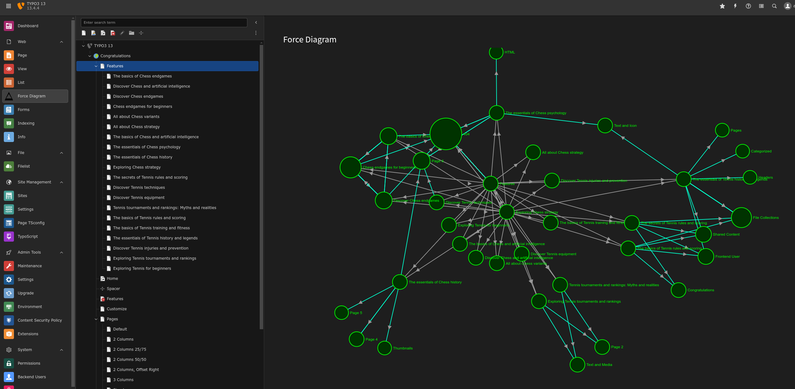
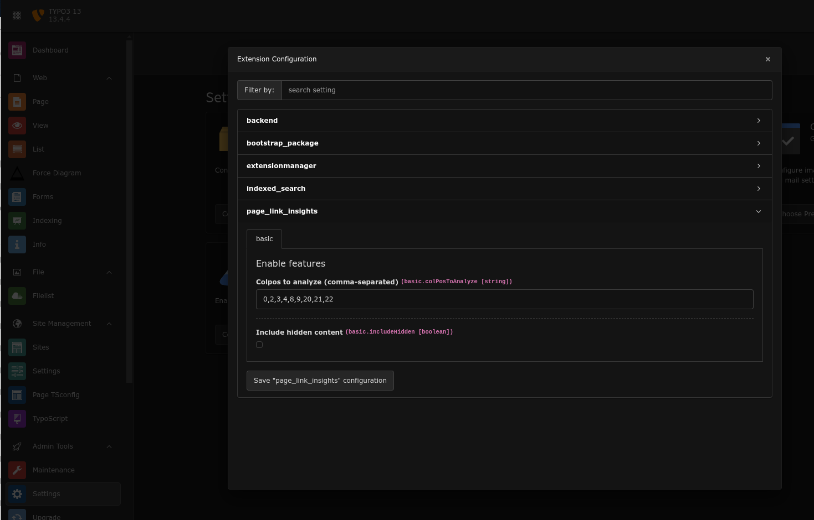
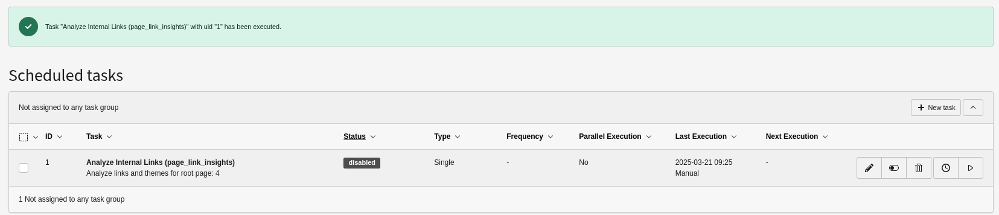

# TYPO3 Page Link Insights Extension



This TYPO3 extension helps you optimize your website's internal linking structure by providing a powerful visual representation of content-based page connections. Page Link Insights focuses specifically on links within your content elements, helping you understand and improve your site's semantic link structure and SEO performance.

## Features

### Comprehensive Link Analysis
- **Interactive Force Diagram**: Visualize page relationships with D3.js
- **Reference Index Based**: Every link comes from a typolink TYPO3 actually
  recorded, wherever it was authored: rich text, header links, FlexForms, page
  shortcuts and link fields declared by third-party extensions
- **Menu Expansion**: Menu elements resolve to the pages they really render
- **Broken Link Detection**: References to pages that no longer exist are shown
  as red dashed edges towards a placeholder node

### One Language at a Time
- **Language Selector**: Switch the whole analysis between the languages of the site
- **No Blending**: Links, page titles, keywords, themes and statistics all follow
  the selected language, so translations never contaminate one another

### Advanced Page Metrics
- **PageRank Calculation**: See which pages carry the most authority
- **Centrality Scores**: Identify key junction pages in your content
- **Inbound/Outbound Links**: Track connection counts for each page
- **Broken Link Detection**: Automatically identify and visualize broken references

### Thematic Analysis
- **Keyword Extraction**: Automatically identify significant terms on each page
- **TF-IDF Ranking**: Terms are scored against the analysed subtree, so a word
  carried by most pages is treated as vocabulary rather than subject matter
- **Language From Site Configuration**: Stop word lists follow the language the
  site declares, not a guess made from the text
- **Theme Clustering**: Group related content by detected themes
- **NLP Integration**: Uses NlpTools for advanced text analysis

### Global Statistics
- **Network Density**: Understand overall interconnection level
- **Orphaned Pages**: Find pages with no incoming links
- **Link Averages**: Track average connections per page
- **SEO Insights**: Identify structural improvements

### Solr Integration
- **Enhanced Relevance**: Boost search results based on PageRank and link metrics
- **Custom Fields**: Add link metrics to Solr index
- **Sorting Options**: Allow sorting by page importance

### Scheduler Task
- **Automated Analysis**: Schedule regular site structure analysis
- **Theme Processing**: Update thematic groupings automatically
- **Historical Tracking**: Maintain metrics history for trend analysis

## Requirements

- TYPO3 14.0+
- PHP 8.2+
- NlpTools extension 2.x (for thematic analysis)

## Upgrading to 3.0

Two steps are required after updating, and the module will not show meaningful
data until both are done.

1. **Run the database schema update** (Admin Tools > Maintenance > Analyze
   Database Structure, or `vendor/bin/typo3 extension:setup`). Statistics are
   now recorded per language and need a new column.
2. **Build the reference index** if your installation has never done so:
   `vendor/bin/typo3 referenceindex:update`, or the "Update reference index"
   scheduler task. Links are read from that index; the module warns when it is
   empty.

Re-run the "Analyze Internal Links" scheduler task afterwards to refresh
statistics and themes for every configured language.

Expect the link count to change, usually downwards. Version 2 matched any bare
number in a content element against the page uids and turned the hits into
links, which inflated the diagram with relations nobody ever authored.

## Installation

### Via Composer

```bash
composer require cywolf/page_link_insights
```

### Via TYPO3 Extension Manager

1. Login to TYPO3 Backend
2. Go to Admin Tools > Extensions
3. Click on "Get Extensions"
4. Search for "page_link_insights"
5. Click "Import and Install"

## Configuration

The extension can be configured through the Extension Configuration in TYPO3 Backend:



1. Go to Admin Tools > Settings > Extension Configuration
2. Select "page_link_insights"
3. Configure the following options:
   - `colPosToAnalyze`: Comma-separated list of content column positions to analyze (default: 0)
   - `includeHidden`: Whether to include hidden pages and content elements (default: false)
   - `includeShortcuts`: Include shortcut pages (doktype 4) as nodes in diagrams (default: false)
   - `includeExternalLinks`: Include external link pages (doktype 3) as nodes in diagrams (default: false)
   - `includeSysFolders`: Include system folders (doktype 254) as nodes in diagrams. Enable this when sys-folders are used as menu entry points (default: false)

### Scheduler Task

The analysis can be run either **manually** or on a **recurring schedule** — there is no single "right" frequency.

To set it up:

1. Go to Scheduler module
2. Add a new task
3. Select "Analyze Page Links and Themes"
4. Configure the root page ID
5. Choose how the task should run (see below)



#### How often should it run?

The task simply recomputes the link/theme metrics for the configured subtree. Once it has run, the results stay available in the Page Link Insights backend module until the next run. So the frequency only depends on **how often your link structure changes** and how fresh you need the metrics to be:

- **Run it manually** (recommended for most users): just execute the task once whenever you want up-to-date metrics — typically right before reviewing your internal linking. No recurring schedule needed.
- **Daily / weekly**: useful if editors frequently add or restructure content and you want the metrics kept current automatically. Daily is plenty for most editorial sites.
- **More frequently (e.g. hourly)** only makes sense on sites with constant content changes where you actively monitor linking in near-real-time.

> **Avoid very short intervals (e.g. every minute).** The task scans the whole subtree and writes the results to the database. Running it that often wastes resources for no practical benefit, since the analysis rarely changes between runs. Match the frequency to your editorial rhythm instead.


## Usage

### Visualizing Page Links

1. Open the TYPO3 Backend
2. Navigate to the Web > Page Link Insights module
3. Select a page in the page tree
4. Explore the force diagram visualization:
   - Larger nodes indicate pages with more incoming links
   - Colors represent different link types
   - Dashed red lines indicate broken links
   - Hover over elements for detailed information

### Interactive Features

- **Zoom and Pan**: Navigate through complex diagrams
- **Drag Nodes**: Reposition elements for better visualization
- **Ctrl+Click**: Open the page directly in TYPO3
- **Right-Click**: Remove node from visualization (temporary)
- **Tooltips**: Show detailed page and link information

### Understanding Thematic Analysis

The extension now includes thematic analysis capabilities that:

- Automatically extract significant keywords from your pages
- Group these keywords into global themes
- Associate themes with relevant pages
- Visualize themes in the D3.js force diagram with color coding

Pages with similar content will be grouped together and colored according to their dominant theme, providing instant visual insights into your content structure.

#### NLP Support

- If the `cywolf/nlp-tools` extension is installed, it will be used for advanced linguistic analysis
- If this extension is not available or encounters errors, a fallback method is automatically used
- In all cases, relevant themes will be generated for your pages

The clustering visualization works in both TYPO3 v12 and v13, and is compatible with PHP 8.1 and 8.2.

### Solr Integration

For search functionality enhancement, see [README_SOLR.md](README_SOLR.md).

## Troubleshooting

- **Empty Visualization**: Build the reference index first
  (`vendor/bin/typo3 referenceindex:update`); the module displays a warning when
  it is empty. Then check that the selected page has content with page references
- **Missing Links**: Check if links are in the analyzed column positions
- **Performance Issues**: Large sites may need higher PHP memory limits
- **Theme Analysis Errors**: Verify NlpTools extension is installed

## Support and Contribution

For bug reports and feature requests, please use the issue tracker on GitHub:
[Project Issue Tracker](https://github.com/friteuseb/page_link_insights/issues)

## License

This project is licensed under the GNU General Public License v2.0.